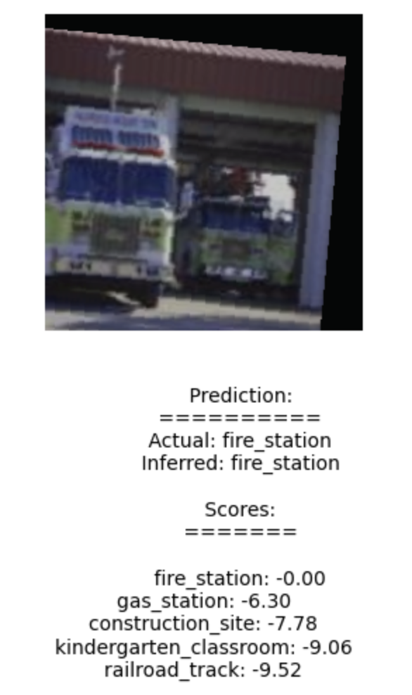
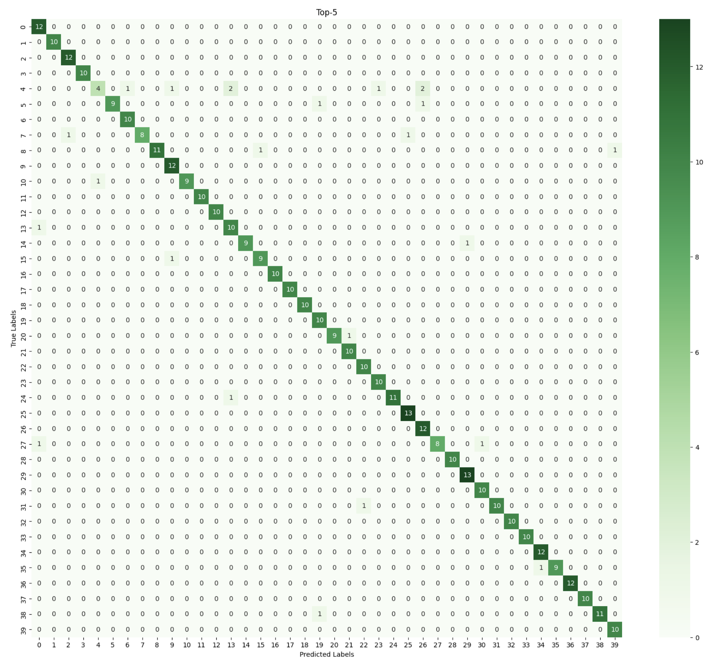

# Convolutional Neural Networks for Scene Recognition

The aim of this project was to use CNNs and Transfer Learning for scene recognition. A resnet34-based network was trained to classify 40 different scenes.

## Hyperparameters exploration

- Batch size
- Learning rate
- Number of epochs
- Optimizer
- Weight decay
- Scheduler

## Results

The following hyperparameters achieved the best result:

| Batch Size | Learning Rate | Optimizer | Scheduler             | Gamma Value | Weight Decay | Epochs |
| ---------- | ------------- | --------- | --------------------- | ----------- | ------------ | ------ |
| 512        | 0.0001        | Adam      | exponential_scheduler | 0.90        | 0.0005       | 40     |

Performance metrics on validation and test sets:

|            | Top-1 Accuracy | Top-5 Accuracy | Top-1 Precision | Top-1 Recall | Top-1 F1 | Top-5 Precision | Top-5 Recall | Top-5 F1 |
| ---------- | -------------- | -------------- | --------------- | ------------ | -------- | --------------- | ------------ | -------- |
| Validation | 59.49%         | 86.59%         | 0.60            | 0.59         | 0.60     | 0.86            | 0.86         | 0.86     |
| Test       | 71.56%         | 94.41%         | 0.73            | 0.71         | 0.70     | 0.94            | 0.94         | 0.94     |

### Examples of Model Classification Results


<div style="display: flex; flex-wrap: wrap; gap: 10px;">
  
  
  
  
  
  
  
  
  
  
</div>

### Loss Curve & Validation Accuracy

<table>
  <tr>
    <td></td>
    <td></td>
  </tr>
  <tr>
    <td align="center"><strong>Loss Curve</strong></td>
    <td align="center"><strong>Validation Accuracy</strong></td>
  </tr>
</table>
### Confusion Matrix on Validation set



## Environment Setup

Clone this repository

```bash
git clone https://github.com/RozaDler/Scene-recognitionCNN.git
```

Create conda virtual environment

```bash
conda create --name scene-recognition  python=3.11
```

Note: you can alternatively use virtualenv python module to create a virtual environment

Activate the environment by using

```bash
conda activate scene-recognition
```

## Training and Testing

### Notebook

[01-train-scene-recognition.ipynb](./notebooks/01-train-scene-recognition.ipynb)

### Script for cloud training

```bash
python train.py
```

## Evaluation

### Notebook

[02-evaluate-scene-recognition.ipynb](./notebooks/02-evaluate-scene-recognition.ipynb)

## Clean up

Deactivate virtual environment

```bash
conda deactivate
```
